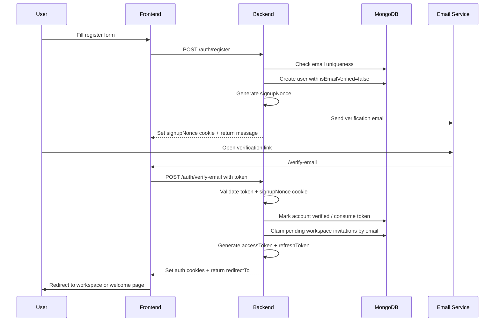
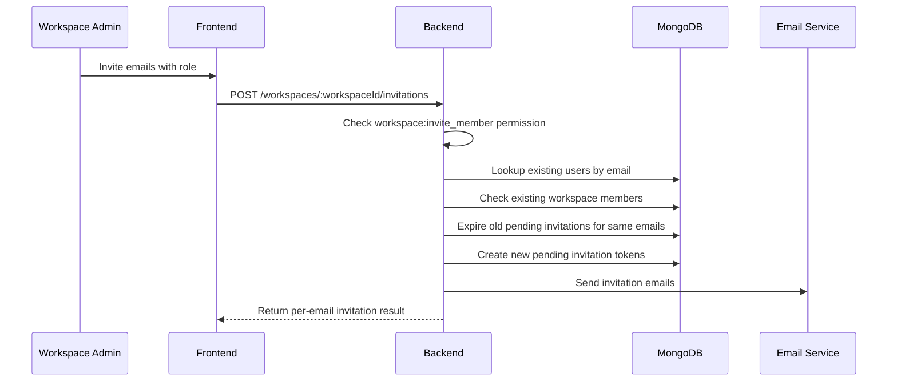
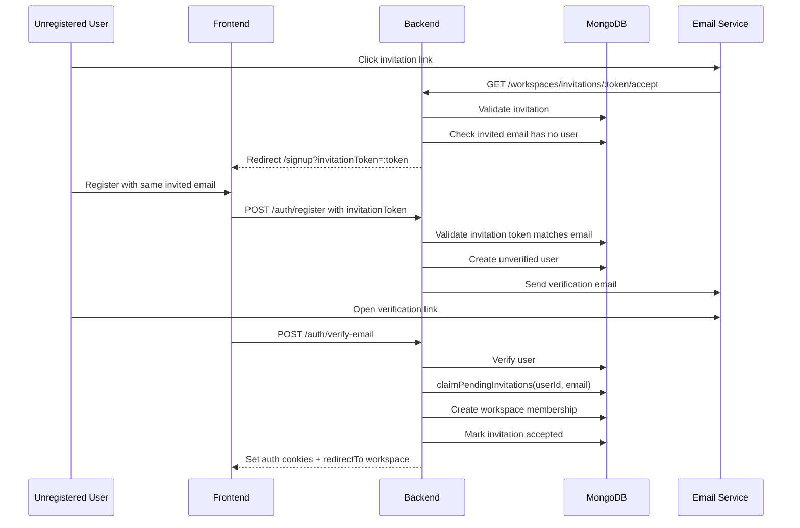
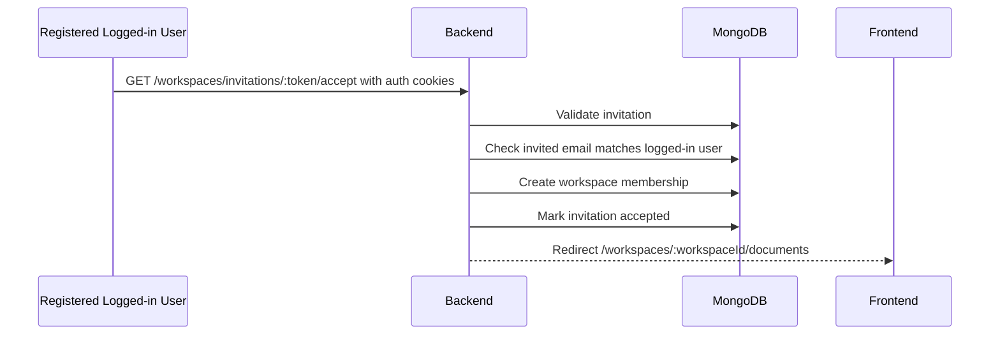
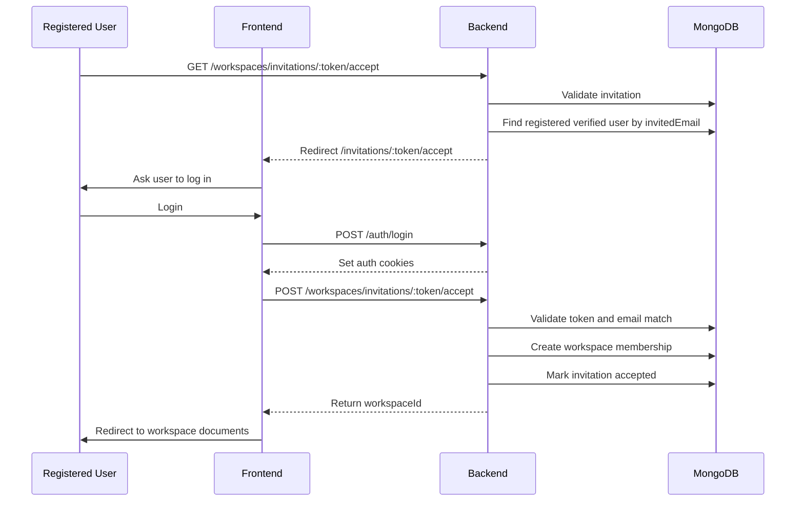

# FOLIO

## Auth & Workspace Invitation Flow


### 1. Register Flow

#### Goal

Allow a new user to create an account, verify their email, start a session, and optionally join a workspace if they registered through an invitation link.

#### Main endpoints

| Step | Method | Endpoint | Purpose |
|---|---:|---|---|
| Register | `POST` | `/auth/register` | Create an unverified user and send verification email |
| Legacy email verify redirect | `GET` | `/auth/verify-email?token=...` | Redirect old email links to FE `/verify-email#token=...` |
| Verify email | `POST` | `/auth/verify-email` | Verify account, start session, claim pending invitations |
| Login | `POST` | `/auth/login` | Login verified user |
| Refresh session | `POST` | `/auth/refresh-token` | Rotate refresh token from cookie |
| Logout | `POST` | `/auth/logout` | Revoke tokens and clear cookies |
| Current user | `GET` | `/auth/me` | Return authenticated user |

#### Flow



#### Details

When the user calls `POST /auth/register`, the backend:

1. Normalizes the email to lowercase.
2. Rejects duplicate email.
3. If `invitationToken` exists, validates that the invitation is pending, not expired, and belongs to the same email.
4. Hashes the password.
5. Creates the user with `isEmailVerified = false`.
6. Generates a `signupNonce`.
7. Sends a verification email.
8. Stores `signupNonce` in an HTTP-only cookie.

The verification token is not enough by itself. The user must verify from the same browser where they registered because the backend also requires the `signupNonce` cookie. This prevents a stolen verification link from being used easily in another browser.

After `POST /auth/verify-email` succeeds, the backend:

1. Validates and consumes the email verification token.
2. Checks the `signupNonce`.
3. Claims all pending workspace invitations for that email.
4. Generates an access token and refresh token.
5. Sets `accessToken` and `refreshToken` cookies.
6. Clears the `signupNonce` cookie.
7. Returns the user and a `redirectTo` path.

If the user joined a workspace through invitation, `redirectTo` points to that workspace document page. Otherwise, it redirects to the welcome page.

#### Login rule

A user cannot log in before verifying their email. If `isEmailVerified` is false, login returns a forbidden error.

---

## 2. Workspace Invitation Flow

#### Goal

Allow a workspace admin to invite users by email. The system supports both registered users and unregistered users.

#### Main endpoints

| Step | Method | Endpoint | Purpose |
|---|---:|---|---|
| Invite member | `POST` | `/workspaces/:workspaceId/invitations` | Admin invites one or more emails |
| Email link entry | `GET` | `/workspaces/invitations/:token/accept` | Public/optional-auth entry point from email |
| Accept invitation | `POST` | `/workspaces/invitations/:token/accept` | Authenticated user accepts invitation |
| Accept invitation alt | `POST` | `/workspaces/invitations/:token/accept-authenticated` | Authenticated accept endpoint |
| List pending invitations | `GET` | `/workspaces/:workspaceId/invitations` | Admin views pending invitations |
| Cancel invitation | `DELETE` | `/workspaces/:workspaceId/invitations/:invitationId` | Admin cancels pending invitation |

---

### 2.1 Invite Creation Flow



When an admin invites users, the backend:

1. Checks that the actor is a workspace admin or has `workspace:invite_member`.
2. Looks up all invited emails in the users collection.
3. Checks whether any registered users are already members.
4. Returns `already_member` for users who are already in the workspace.
5. Expires old pending invitations for the same workspace/email.
6. Creates a new pending `WorkspaceInvitation`.
7. Stores:
   - `workspaceId`
   - `invitedEmail`
   - `invitedUserId` if the email already belongs to a registered user
   - `invitedBy`
   - `role`
   - `token`
   - `status = pending`
   - `expiresAt`
8. Sends an invitation email with this link:

```txt
/api/workspaces/invitations/:token/accept
```

---

### 2.2 Case A: Invited User Is Unregistered

#### Flow



#### Behavior

If the invited email does not belong to any user, the invitation link redirects to:

```txt
/signup?invitationToken=:token
```

The user must register with the same email as the invitation. During registration, the backend validates:

1. Invitation exists.
2. Invitation is still pending.
3. Invitation is not expired.
4. Signup email matches `invitedEmail`.

After the user verifies their email, the backend calls `claimPendingInvitations(userId, email)`. This automatically:

1. Finds all pending, unexpired invitations for the verified email.
2. Creates workspace memberships.
3. Marks invitations as accepted.
4. Removes external document permissions that are no longer needed after joining the workspace.
5. Redirects the user to the first joined workspace.

---

### 2.3 Case B: Invited User Is Already Registered

#### Case B1: Registered and already logged in



If the user is already logged in, the public invitation entry point can detect the authenticated user through optional auth. The backend then accepts the invitation immediately and redirects the user to:

```txt
/workspaces/:workspaceId/documents
```

#### Case B2: Registered but not logged in



If the invited email belongs to a registered and verified user but the user is not logged in, the backend redirects to the frontend accept page:

```txt
/invitations/:token/accept
```

The frontend should then ask the user to log in. After login, the frontend calls:

```txt
POST /workspaces/invitations/:token/accept
```

The backend validates:

1. Invitation exists.
2. Invitation is pending.
3. Invitation is not expired.
4. Logged-in user exists.
5. Logged-in user email matches `invitedEmail`.
6. User is not already a workspace member.

Then it creates the membership and marks the invitation as accepted.

#### Case B3: Registered but not email verified

If the invited email belongs to a user whose email is not verified, the invitation link redirects to:

```txt
/verify-email?email=:email&reason=verify_required
```

The user must verify their email before accepting or joining the workspace.

---

### 3. Security Rules

#### Email verification

- New users are created as `isEmailVerified = false`.
- Login is blocked until email verification succeeds.
- Verification requires both:
  - verification token
  - `signupNonce` cookie from the original signup browser
- The verification token is consumed after use.

#### Invitation

- Invitation token must exist.
- Invitation status must be `pending`.
- Invitation must not be expired.
- Signup email or logged-in user email must match the invited email.
- Existing workspace members cannot accept the same invitation again.
- Old pending invitations for the same workspace/email are expired when a new invitation is created.

#### Session

- Access token and refresh token are stored in cookies.
- Refresh token is read from cookie and rotated through `/auth/refresh-token`.
- Logout revokes tokens and clears auth cookies.

---

### 4. Summary

```txt
Register:
  POST /auth/register
  -> create unverified user
  -> set signupNonce cookie
  -> send verification email
  -> POST /auth/verify-email
  -> verify token + nonce
  -> claim pending invitations
  -> set auth cookies

Invite unregistered user:
  Admin invites email
  -> user clicks invitation
  -> redirect signup with invitationToken
  -> register with same email
  -> verify email
  -> auto-join workspace

Invite registered user:
  Admin invites email
  -> user clicks invitation
  -> if logged in: accept immediately
  -> if not logged in: login first, then POST accept
  -> backend validates email match
  -> create workspace membership
```
