# FOLIO

## Auth & Workspace Invitation Flow


### 1. Register Flow

#### Goal

Allow a new user to create an account, verify their email, start a session, and optionally join a workspace if they registered through an invitation link.

#### Main endpoints

| Step | Method | Endpoint | Purpose |
|---|---:|---|---|
| Register | `POST` | `/auth/register` | Create an unverified user and send verification email |
| Legacy email verify redirect | `GET` | `/auth/verify-email?token=...` | Redirect old email links to FE `/verify-email#token=...` |
| Verify email | `POST` | `/auth/verify-email` | Verify account, start session, claim pending invitations |
| Login | `POST` | `/auth/login` | Login verified user |
| Refresh session | `POST` | `/auth/refresh-token` | Rotate refresh token from cookie |
| Logout | `POST` | `/auth/logout` | Revoke tokens and clear cookies |
| Current user | `GET` | `/auth/me` | Return authenticated user |

#### Flow

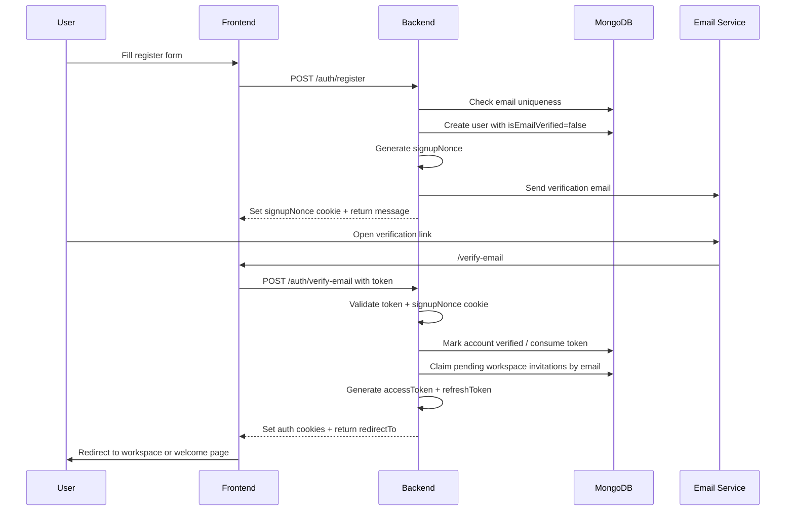

#### Details

When the user calls `POST /auth/register`, the backend:

1. Normalizes the email to lowercase.
2. Rejects duplicate email.
3. If `invitationToken` exists, validates that the invitation is pending, not expired, and belongs to the same email.
4. Hashes the password.
5. Creates the user with `isEmailVerified = false`.
6. Generates a `signupNonce`.
7. Sends a verification email.
8. Stores `signupNonce` in an HTTP-only cookie.

The verification token is not enough by itself. The user must verify from the same browser where they registered because the backend also requires the `signupNonce` cookie. This prevents a stolen verification link from being used easily in another browser.

After `POST /auth/verify-email` succeeds, the backend:

1. Validates and consumes the email verification token.
2. Checks the `signupNonce`.
3. Claims all pending workspace invitations for that email.
4. Generates an access token and refresh token.
5. Sets `accessToken` and `refreshToken` cookies.
6. Clears the `signupNonce` cookie.
7. Returns the user and a `redirectTo` path.

If the user joined a workspace through invitation, `redirectTo` points to that workspace document page. Otherwise, it redirects to the welcome page.

#### Login rule

A user cannot log in before verifying their email. If `isEmailVerified` is false, login returns a forbidden error.

---

## 2. Workspace Invitation Flow

#### Goal

Allow a workspace admin to invite users by email. The system supports both registered users and unregistered users.

#### Main endpoints

| Step | Method | Endpoint | Purpose |
|---|---:|---|---|
| Invite member | `POST` | `/workspaces/:workspaceId/invitations` | Admin invites one or more emails |
| Email link entry | `GET` | `/workspaces/invitations/:token/accept` | Public/optional-auth entry point from email |
| Accept invitation | `POST` | `/workspaces/invitations/:token/accept` | Authenticated user accepts invitation |
| Accept invitation alt | `POST` | `/workspaces/invitations/:token/accept-authenticated` | Authenticated accept endpoint |
| List pending invitations | `GET` | `/workspaces/:workspaceId/invitations` | Admin views pending invitations |
| Cancel invitation | `DELETE` | `/workspaces/:workspaceId/invitations/:invitationId` | Admin cancels pending invitation |

---

### 2.1 Invite Creation Flow

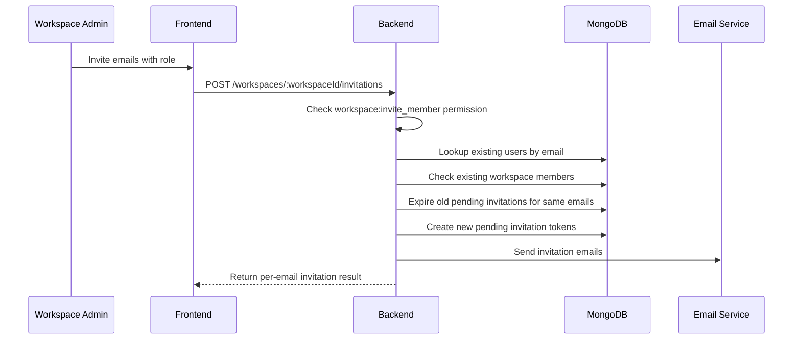

When an admin invites users, the backend:

1. Checks that the actor is a workspace admin or has `workspace:invite_member`.
2. Looks up all invited emails in the users collection.
3. Checks whether any registered users are already members.
4. Returns `already_member` for users who are already in the workspace.
5. Expires old pending invitations for the same workspace/email.
6. Creates a new pending `WorkspaceInvitation`.
7. Stores:
   - `workspaceId`
   - `invitedEmail`
   - `invitedUserId` if the email already belongs to a registered user
   - `invitedBy`
   - `role`
   - `token`
   - `status = pending`
   - `expiresAt`
8. Sends an invitation email with this link:

```txt
/api/workspaces/invitations/:token/accept
```

---

### 2.2 Case A: Invited User Is Unregistered

#### Flow

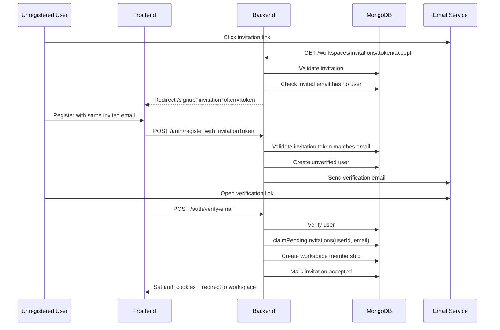

#### Behavior

If the invited email does not belong to any user, the invitation link redirects to:

```txt
/signup?invitationToken=:token
```

The user must register with the same email as the invitation. During registration, the backend validates:

1. Invitation exists.
2. Invitation is still pending.
3. Invitation is not expired.
4. Signup email matches `invitedEmail`.

After the user verifies their email, the backend calls `claimPendingInvitations(userId, email)`. This automatically:

1. Finds all pending, unexpired invitations for the verified email.
2. Creates workspace memberships.
3. Marks invitations as accepted.
4. Removes external document permissions that are no longer needed after joining the workspace.
5. Redirects the user to the first joined workspace.

---

### 2.3 Case B: Invited User Is Already Registered

#### Case B1: Registered and already logged in

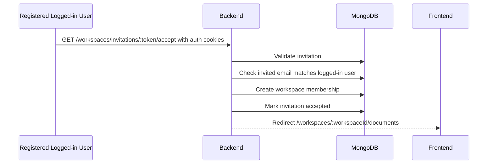

If the user is already logged in, the public invitation entry point can detect the authenticated user through optional auth. The backend then accepts the invitation immediately and redirects the user to:

```txt
/workspaces/:workspaceId/documents
```

#### Case B2: Registered but not logged in

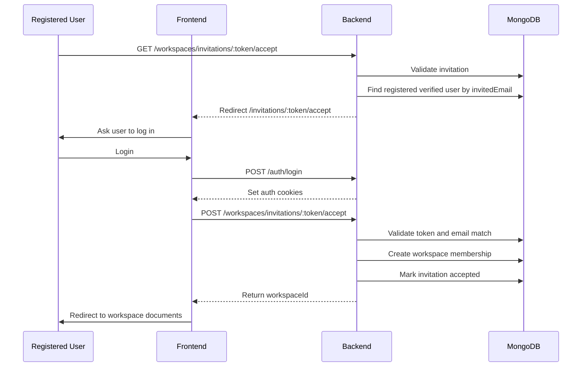

If the invited email belongs to a registered and verified user but the user is not logged in, the backend redirects to the frontend accept page:

```txt
/invitations/:token/accept
```

The frontend should then ask the user to log in. After login, the frontend calls:

```txt
POST /workspaces/invitations/:token/accept
```

The backend validates:

1. Invitation exists.
2. Invitation is pending.
3. Invitation is not expired.
4. Logged-in user exists.
5. Logged-in user email matches `invitedEmail`.
6. User is not already a workspace member.

Then it creates the membership and marks the invitation as accepted.

#### Case B3: Registered but not email verified

If the invited email belongs to a user whose email is not verified, the invitation link redirects to:

```txt
/verify-email?email=:email&reason=verify_required
```

The user must verify their email before accepting or joining the workspace.

---

### 3. Security Rules

#### Email verification

- New users are created as `isEmailVerified = false`.
- Login is blocked until email verification succeeds.
- Verification requires both:
  - verification token
  - `signupNonce` cookie from the original signup browser
- The verification token is consumed after use.

#### Invitation

- Invitation token must exist.
- Invitation status must be `pending`.
- Invitation must not be expired.
- Signup email or logged-in user email must match the invited email.
- Existing workspace members cannot accept the same invitation again.
- Old pending invitations for the same workspace/email are expired when a new invitation is created.

#### Session

- Access token and refresh token are stored in cookies.
- Refresh token is read from cookie and rotated through `/auth/refresh-token`.
- Logout revokes tokens and clears auth cookies.

---

### 4. Summary

```txt
Register:
  POST /auth/register
  -> create unverified user
  -> set signupNonce cookie
  -> send verification email
  -> POST /auth/verify-email
  -> verify token + nonce
  -> claim pending invitations
  -> set auth cookies

Invite unregistered user:
  Admin invites email
  -> user clicks invitation
  -> redirect signup with invitationToken
  -> register with same email
  -> verify email
  -> auto-join workspace

Invite registered user:
  Admin invites email
  -> user clicks invitation
  -> if logged in: accept immediately
  -> if not logged in: login first, then POST accept
  -> backend validates email match
  -> create workspace membership
```

## Workspace Flow

### 1. Create Workspace

#### Goal

Allow an authenticated user to create a new workspace and become the workspace owner/admin.

#### Flow

User creates a workspace by providing basic workspace information such as name and optional banner/image. After the workspace is created, the system automatically adds the creator as the first workspace member with the highest role.

#### Main Steps

1. User submits workspace creation form.
2. Backend validates user authentication.
3. Backend creates a new workspace record.
4. Backend creates a workspace member record for the creator.
5. Frontend redirects user to the new workspace page.

#### Result

A new workspace is created and the creator can manage documents, members, and workspace settings.

---

### 2. Read Workspace

#### Goal

Allow authenticated users to view workspaces that they are allowed to access.

#### Flow

The user can view a list of workspaces they belong to, or open a specific workspace by workspace ID. The backend checks whether the user is a member before returning workspace data.

#### Main Steps

1. User opens dashboard or workspace page.
2. Frontend requests workspace list or workspace detail.
3. Backend checks authentication.
4. Backend returns only workspaces where the user is a member.
5. Frontend displays workspace information.

#### Result

The user can only see workspaces they have access to.

---

### 3. Update Workspace

#### Goal

Allow workspace admins to update workspace information.

#### Flow

A workspace admin can update workspace metadata such as name, description, or banner. Normal members can view the workspace but cannot update its settings.

#### Main Steps

1. Admin opens workspace settings.
2. Admin updates workspace information.
3. Backend checks user permission.
4. Backend updates the workspace record.
5. Frontend refreshes workspace data.

#### Result

Workspace information is updated for all members.

---

### 4. Delete Workspace

#### Goal

Allow authorized users to delete a workspace.

#### Flow

Only users with workspace management permission can delete a workspace. When a workspace is deleted, related workspace data such as members, invitations, documents, or permissions should also be handled according to the backend cleanup strategy.

#### Main Steps

1. Admin requests workspace deletion.
2. Backend checks user permission.
3. Backend deletes or cleans up workspace-related data.
4. Frontend redirects user away from the deleted workspace.

#### Result

The workspace is removed and users can no longer access it.

---

### 5. Permission Rules

#### Goal

Protect workspace actions based on user role.

#### Rules

Workspace actions are controlled by role-based permissions.

- Workspace members can view the workspace and create documents.
- Workspace admins can manage workspace settings, invite members, remove members, and delete the workspace.
- Users who are not workspace members cannot access workspace data.

#### Result

Workspace data and actions are protected from unauthorized users.

## Documents Flow

### 1. Overview

#### Goal

The Document module is the core service of FOLIO. It manages the full lifecycle of a document inside a workspace.

The module supports two document creation sources:

```txt
Markdown editor
PDF file upload
```

Regardless of the source, the final viewer format is PDF. Markdown documents are converted into PDF in the background, while uploaded PDF files are stored directly and then processed for text preview.

The Document module is responsible for:

```txt
Create document
Upload PDF
Cancel upload
Convert markdown to PDF
Extract PDF text preview
List workspace documents
View document detail
Rename document
Delete document
Edit PDF content
Re-process edited PDF
Manage document processing status
Record document activity logs
Attach available permissions to document responses
```

---

### 2. Document Data Model

#### Goal

The document record stores metadata, source information, PDF storage information, extracted text preview, processing state, and version.

Main fields:

```txt
workspaceId
title
sourceType
ownerId
markdownContent
pdfFileUrl
pdfStorageKey
fileSize
extractedTextPreview
extractedTextCharCount
extractedTextLimit
isExtractedTextTruncated
processingStatus
version
createdAt
updatedAt
```

#### Field Explanation

```txt
workspaceId:
  The workspace that owns the document.

title:
  Display name of the document.

sourceType:
  Document creation source.
  Supported values:
    md_editor
    file_upload

ownerId:
  The user who created the document.

markdownContent:
  Original markdown content.
  Used for documents created from the markdown editor.

pdfFileUrl:
  Public or resolved URL for viewing the PDF.

pdfStorageKey:
  Stable storage key of the PDF file.
  This is the canonical reference used by the backend storage provider.

fileSize:
  Size of the generated or uploaded PDF file.

extractedTextPreview:
  Extracted searchable text preview.
  The app stores only a limited text preview instead of the whole file text.

extractedTextCharCount:
  Number of characters stored in extractedTextPreview.

extractedTextLimit:
  Maximum number of extracted characters.
  Current default: 10,000.

isExtractedTextTruncated:
  Whether the original extracted text was longer than the stored preview.

processingStatus:
  Current processing state of the document.

version:
  Document version.
  Incremented when PDF content is edited.

createdAt / updatedAt:
  Automatically managed timestamps.
```

---

### 3. Processing Status

#### Goal

Processing status tells the frontend whether the document is ready to open.

Supported statuses:

```txt
processing
processed
unprocessable
```

#### processing

The document exists, but the PDF or text preview is still being generated or extracted.

Common cases:

```txt
Markdown document was just created
PDF upload is being extracted
PDF content was edited and is being reprocessed
```

Frontend behavior:

```txt
Show loading or processing state
Avoid opening the viewer as final content
```

#### processed

The document is ready.

Common cases:

```txt
Markdown was converted to PDF successfully
Uploaded PDF was parsed successfully
Edited PDF was overwritten and reprocessed successfully
```

Frontend behavior:

```txt
Allow user to open and view the document
Allow actions based on permissions
```

#### unprocessable

The document could not be processed.

Common cases:

```txt
PDF extraction failed
PDF is corrupted
PDF is too complex for parser
Generated PDF failed
```

Frontend behavior:

```txt
Show error or unsupported document state
Avoid treating extracted text as available
```

---

### 4. Permission Requirements

#### Goal

Document APIs are protected by workspace and document permissions.

The Document module uses two permission layers:

```txt
Workspace permission
Document permission
```

#### Workspace-level Checks

Used for actions that happen inside the workspace document collection.

```txt
Create markdown document:
  workspace:create_document

Create upload job:
  workspace:create_document

Upload PDF:
  workspace:create_document

Cancel upload:
  workspace:create_document

List workspace documents:
  workspace:view
```

#### Document-level Checks

Used for actions on one existing document.

```txt
View document detail:
  document:view

Edit PDF content:
  document:edit

Rename document:
  document:rename

Delete document:
  document:delete

View document members/access:
  document:manage_access
```

#### Backend Rule

The frontend may hide buttons based on permissions, but the backend is always the source of truth.

Every sensitive document action must still be protected by permission guards.

---

### 5. Create Markdown Document Flow

#### Goal

Allow a user to create a document from the built-in markdown editor.

The markdown content is stored first, then converted into a PDF asynchronously.

#### Endpoint

```txt
POST /workspaces/:workspaceId/documents
```

Required permission:

```txt
workspace:create_document
```

Expected source type:

```txt
md_editor
```

#### Flow

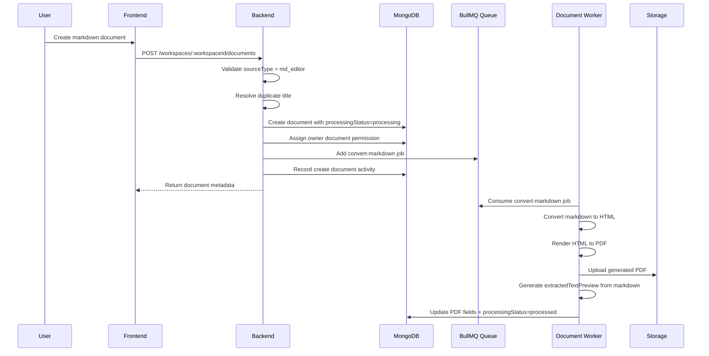

#### Backend Steps

1. Validate that `sourceType` is `md_editor`.
2. Resolve the title.
3. If another document in the workspace already has the same title, append a suffix such as:

```txt
Document
Document (1)
Document (2)
```

4. Create the document with:

```txt
sourceType = md_editor
processingStatus = processing
markdownContent = user input
```

5. Assign the creator as document owner.
6. Add a `convert-markdown` job to the `document-processing` queue.
7. Record a create document activity log.
8. Return the created document metadata to the frontend.

#### Worker Steps

The background worker handles the heavy work:

```txt
Markdown
-> HTML
-> PDF buffer
-> Storage upload
-> Text preview generation
-> Document update
```

The markdown text is converted to plain text and stored as `extractedTextPreview`.

Only the first 10,000 characters are stored.

If conversion succeeds:

```txt
processingStatus = processed
pdfStorageKey = generated storage key
pdfFileUrl = generated file URL
fileSize = generated PDF size
extractedTextPreview = first 10,000 chars
```

If conversion fails:

```txt
processingStatus = unprocessable
```

---

### 6. Upload PDF Flow

#### Goal

Allow a user to upload an existing PDF file into a workspace.

The uploaded file is stored, then its text is extracted asynchronously.

The upload flow uses an upload job so the frontend can show progress and support cancellation.

---

### 6.1 Create Upload Job

#### Goal

Create an upload job before sending the PDF file.

#### Endpoint

```txt
POST /workspaces/:workspaceId/documents/upload-jobs
```

Required permission:

```txt
workspace:create_document
```

#### Flow

```txt
Frontend requests upload job
Backend creates jobId
Frontend uses jobId when uploading the PDF
```

#### Result

Backend returns:

```json
{
  "jobId": "..."
}
```

The frontend uses this `jobId` to track progress and cancel the upload if needed.

---

### 6.2 Upload PDF File

#### Endpoint

```txt
POST /workspaces/:workspaceId/documents/upload
```

Required permission:

```txt
workspace:create_document
```

Request type:

```txt
multipart/form-data
```

Required fields:

```txt
file
jobId
```

Optional fields:

```txt
title
```

Validation rules:

```txt
Only PDF files are accepted.
Maximum file size is 20MB.
jobId is required.
```

#### Flow

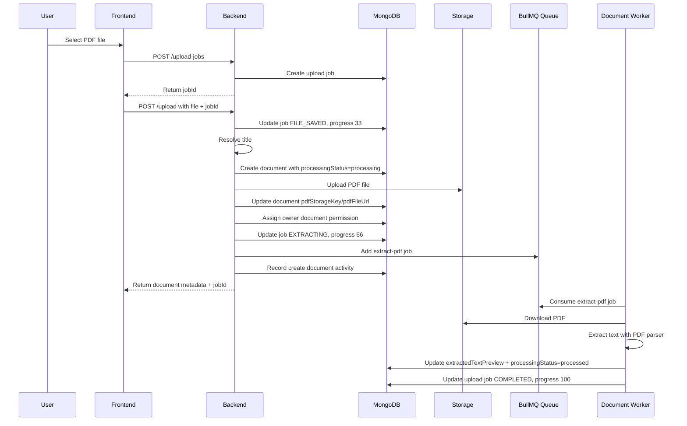

#### Backend Steps

1. Validate file exists.
2. Validate file MIME type is PDF.
3. Validate `jobId` exists.
4. Check if the upload job was cancelled before continuing.
5. Update upload job:

```txt
status = FILE_SAVED
progress = 33
```

6. Resolve document title.
7. Create document record:

```txt
sourceType = file_upload
processingStatus = processing
fileSize = uploaded file size
```

8. Store the document ID in the upload job.
9. Upload PDF buffer to storage.
10. Save `pdfStorageKey` and `pdfFileUrl` to the document.
11. Assign creator as document owner.
12. Update upload job:

```txt
status = EXTRACTING
progress = 66
```

13. Add `extract-pdf` job to the queue.
14. Record create document activity.
15. Return document metadata and `jobId`.

---

### 6.3 PDF Extraction Worker

#### Goal

Extract text from uploaded PDF in the background.

#### Flow

```txt
Worker receives extract-pdf job
-> Check whether upload was cancelled
-> Download PDF from storage
-> Extract text
-> Store text preview
-> Mark document as processed
-> Mark upload job as completed
```

#### Extracted Text Rule

The app stores only a preview of extracted text.

```txt
Maximum extracted text preview: 10,000 characters
```

This avoids storing the full content of large PDFs in MongoDB.

#### Success Result

```txt
processingStatus = processed
extractedTextPreview = first 10,000 characters
upload job status = COMPLETED
upload job progress = 100
```

#### Failure Result

```txt
processingStatus = unprocessable
upload job status = FAILED
```

---

### 7. Cancel Upload Flow

#### Goal

Allow users to cancel an upload that is still pending, uploading, saved, or extracting.

#### Endpoint

```txt
DELETE /workspaces/:workspaceId/documents/upload/:jobId/cancel
```

Required permission:

```txt
workspace:create_document
```

#### Flow

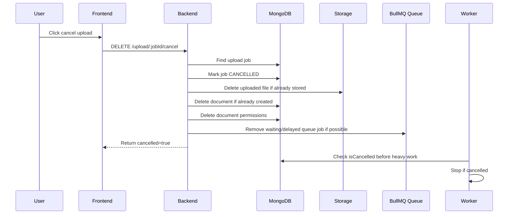

#### Backend Steps

1. Find upload job by `jobId` and `workspaceId`.
2. If job is already completed, failed, or cancelled, return safely.
3. Mark job as:

```txt
status = CANCELLED
isCancelled = true
```

4. If a document was already created:
   - Delete PDF from storage if it exists.
   - Delete document record.
   - Delete document permission records.
5. Remove the BullMQ job if it is still waiting or delayed.
6. Return cancellation result.

#### Important Behavior

Cancellation is designed to be idempotent.

Calling cancel multiple times should not corrupt state.

The worker also checks `isCancelled` before expensive work, so cancellation can still work even after the queue job has started.

---

### 8. List Documents Flow

#### Goal

Return a paginated list of documents inside a workspace.

#### Endpoint

```txt
GET /workspaces/:workspaceId/documents
```

Required permission:

```txt
workspace:view
```

Query parameters:

```txt
page
limit
```

#### Flow

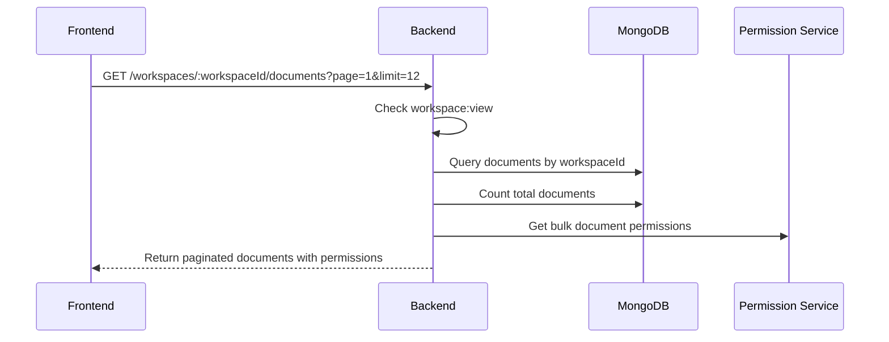

#### Backend Steps

1. Check `workspace:view`.
2. Query documents by `workspaceId`.
3. Sort documents by:

```txt
updatedAt descending
_id descending
```

4. Apply pagination:

```txt
page
limit
skip = (page - 1) * limit
```

5. Count total documents.
6. Resolve document permissions in bulk to avoid N+1 permission queries.
7. Attach permissions to each document item.
8. Return paginated response.

#### Response Shape

The response contains:

```txt
items
page
limit
totalItems
totalPages
hasNextPage
hasPreviousPage
```

Each document item also includes:

```txt
permissions
```

Example:

```txt
document:view
document:edit
document:comment
```

---

### 9. View Document Detail Flow

#### Goal

Return metadata and access information for one document.

#### Endpoint

```txt
GET /workspaces/:workspaceId/documents/:documentId
```

Required permission:

```txt
document:view
```

#### Flow

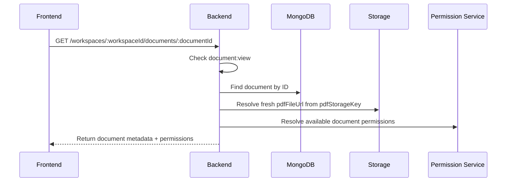

#### Backend Steps

1. Check `document:view`.
2. Find document by ID.
3. Populate owner information.
4. Resolve a fresh `pdfFileUrl` from the storage layer using `pdfStorageKey`.
5. Resolve available document permissions for the current user.
6. Return document data with `permissions`.

#### Frontend Behavior

The frontend uses `processingStatus` to decide what to render.

```txt
processing:
  Show processing state.

processed:
  Open PDF viewer.

unprocessable:
  Show error or unsupported document state.
```

The frontend also uses `permissions` to show or hide actions such as:

```txt
Edit PDF
Comment
Share
Rename
Delete
```

---

### 10. Rename Document Flow

#### Goal

Allow authorized users to rename a document.

#### Endpoint

```txt
PATCH /workspaces/:workspaceId/documents/:documentId/rename
```

Required permission:

```txt
document:rename
```

#### Flow

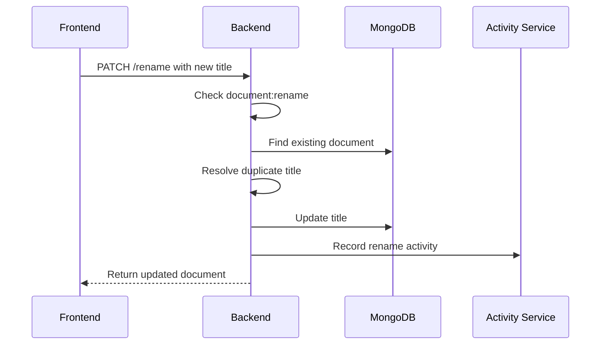

#### Backend Steps

1. Check `document:rename`.
2. Validate new title.
3. Resolve duplicate title inside the same workspace.
4. Update document title.
5. Record activity log:

```txt
changeType = renamed
oldTitle
newTitle
documentTitle
```

6. Return updated document.

#### Duplicate Title Rule

If the requested title already exists in the workspace, the backend appends a suffix.

Example:

```txt
Proposal.pdf
Proposal.pdf (1)
Proposal.pdf (2)
```

This prevents title conflicts inside the same workspace.

---

### 11. Delete Document Flow

#### Goal

Allow authorized users to delete a document.

#### Endpoint

```txt
DELETE /workspaces/:workspaceId/documents/:documentId
```

Required permission:

```txt
document:delete
```

#### Flow

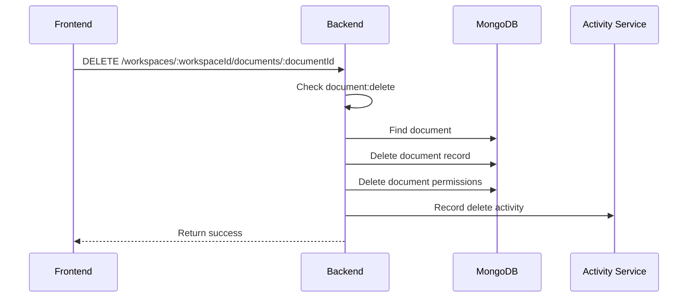

#### Backend Steps

1. Check `document:delete`.
2. Find document by ID.
3. Delete document record.
4. Delete document permission records.
5. Record delete activity.
6. Return success.

#### Cleanup Note

The current delete flow removes the document record and related document permission records.

Related resources such as comments, annotations, pending shares, or storage cleanup should be handled by their owning modules or by a later cleanup strategy if needed.

---

### 12. Edit PDF Flow

#### Goal

Allow authorized users to edit PDF content through Apryse and save the edited PDF back to storage.

This is different from renaming. Rename only updates metadata. Edit PDF replaces the actual PDF file content.

#### Endpoint

```txt
PATCH /workspaces/:workspaceId/documents/:documentId/content
```

Required permission:

```txt
document:edit
```

Request type:

```txt
multipart/form-data
```

Required field:

```txt
file
```

Optional fields:

```txt
editedRects
degradedAnnotationIds
```

#### Field Meaning

```txt
file:
  Edited PDF exported from Apryse.

editedRects:
  Rectangles that represent edited PDF regions.
  Used as a backend fallback for annotation degradation.

degradedAnnotationIds:
  Explicit annotation IDs that should be converted from highlight to point marker.
  This is preferred over editedRects when available.
```

---

### 12.1 Edit PDF Save Flow

#### Flow

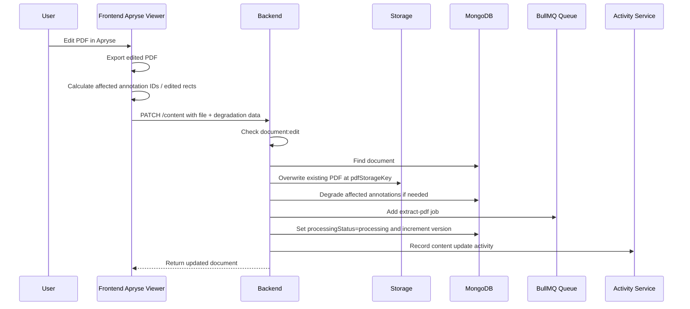

#### Backend Steps

1. Check `document:edit`.
2. Validate uploaded file exists.
3. Validate file is a PDF.
4. Find the document.
5. Parse optional `editedRects`.
6. Parse optional `degradedAnnotationIds`.
7. Overwrite the existing PDF file at the current `pdfStorageKey`.
8. Handle annotation degradation.
9. Add `extract-pdf` job to re-extract text preview from the edited PDF.
10. Update document:

```txt
processingStatus = processing
updatedAt = current time
version = version + 1
```

11. Record update activity:

```txt
changeType = content_updated
title = document title
```

12. Return updated document metadata.

---

### 12.2 Annotation Degradation During PDF Edit

#### Goal

Prevent old highlight annotations from becoming misleading after PDF content changes.

When PDF text is edited, a previous text highlight may no longer accurately point to the original text. In that case, the app degrades the annotation visual state:

```txt
highlight -> point
```

This means the comment still exists, but it is displayed as a point marker instead of a text highlight.

#### Input Priority

The backend uses this rule:

```txt
If degradedAnnotationIds is non-empty:
  Degrade only those explicit annotation IDs.
  Skip editedRects overlap fallback.

Else if editedRects is non-empty:
  Use editedRects as fallback.
  Degrade annotations whose stored position overlaps the edited rects.

Else:
  Do not degrade annotations.
```

#### Why Explicit IDs Are Preferred

Apryse content editing can return coarse content boxes instead of exact edited character ranges.

Because of that, `editedRects` can be too broad. If both explicit IDs and edited rects are applied together, the backend may accidentally degrade extra annotations.

So the backend treats `degradedAnnotationIds` as the source of truth when present.

#### Fallback Behavior

If the frontend cannot calculate explicit annotation IDs, the backend can still use `editedRects`.

The fallback checks whether the stored annotation position is inside an edited rectangle on the same page.

This fallback is useful, but less precise than explicit IDs.

---

### 12.3 Reprocessing After PDF Edit

#### Goal

After PDF content is edited, the extracted text preview may become stale.

The backend therefore re-runs PDF extraction after saving the edited file.

#### Flow

```txt
Edited PDF uploaded
-> Existing storage file overwritten
-> Document status set to processing
-> extract-pdf job added
-> Worker downloads edited PDF
-> Worker extracts text preview
-> Document status becomes processed or unprocessable
```

#### Result

The document stays consistent after content changes.

```txt
PDF file:
  Updated

extractedTextPreview:
  Re-generated

processingStatus:
  processing -> processed
  or
  processing -> unprocessable

version:
  Incremented
```

---

### 13. Storage Flow

#### Goal

Keep PDF files outside MongoDB and store only metadata in the document record.

The app stores the actual PDF file through a storage provider.

The document record keeps:

```txt
pdfStorageKey
pdfFileUrl
```

#### pdfStorageKey

`pdfStorageKey` is the stable internal storage path.

It is used for:

```txt
Uploading generated markdown PDF
Uploading uploaded PDF
Overwriting edited PDF
Downloading PDF for text extraction
Resolving public URL
Deleting file during cancelled upload cleanup
```

#### pdfFileUrl

`pdfFileUrl` is the URL used by the frontend viewer.

When reading document detail, the backend resolves a fresh URL from the storage layer. This allows the app to support local storage, public URLs, signed URLs, or CDN URLs.

---

### 14. Activity Log Integration

#### Goal

Important document actions are recorded as workspace activity.

Document actions currently recorded include:

```txt
Create document
Rename document
Edit document content
Delete document
```

#### Create Document Activity

Recorded when a markdown document or uploaded PDF is created.

Metadata:

```txt
title
sourceType
```

#### Rename Document Activity

Recorded when a document title changes.

Metadata:

```txt
changeType = renamed
oldTitle
newTitle
documentTitle
```

#### Edit Document Activity

Recorded when PDF content is updated.

Metadata:

```txt
changeType = content_updated
title
```

#### Delete Document Activity

Recorded when a document is deleted.

Metadata:

```txt
title
```

Activity logs allow the workspace to show a history of important document operations.

---

### 15. Document Members Flow

#### Goal

Return users who have explicit document permission records.

#### Endpoint

```txt
GET /workspaces/:workspaceId/documents/:documentId/members
```

Required permission:

```txt
document:manage_access
```

#### Flow

```txt
User opens document access/member panel
-> Backend checks document:manage_access
-> Backend queries document permission records
-> Backend populates user information
-> Frontend displays users with document-level access
```

#### Note

This endpoint returns explicit document permission records. It is not the same as the complete effective permission list for all workspace members.

Workspace members may still have document access through workspace role mapping even if they do not appear as explicit document members.

---

### 16. Error Handling

#### Common Errors

```txt
File is required:
  Upload or edit endpoint did not receive a file.

Only PDF files are accepted:
  Uploaded file MIME type is not application/pdf.

jobId is required:
  Upload PDF request did not include upload job ID.

Document not found:
  The target document does not exist.

Job not found:
  Upload cancel request uses an invalid jobId.

Permission denied:
  User does not have the required workspace or document permission.
```

#### Processing Failures

If background processing fails:

```txt
processingStatus = unprocessable
```

For upload jobs, the upload job may also become:

```txt
status = FAILED
```

The frontend should display a clear error state instead of opening the PDF as a normal processed document.

---

### 17. Design Decisions

#### PDF Is the Final Viewer Format

Even when the source is markdown, the app converts the document into PDF.

This keeps the viewer consistent:

```txt
Markdown document -> generated PDF -> PDF viewer
Uploaded PDF -> stored PDF -> PDF viewer
Edited PDF -> overwritten PDF -> PDF viewer
```

#### Background Processing

PDF conversion and text extraction are handled in background jobs.

This prevents long-running operations from blocking the request-response cycle.

The API can quickly return a document in `processing` state, while the worker completes the heavy work later.

#### Text Preview Is Limited

The app stores only a limited text preview instead of full extracted text.

Current limit:

```txt
10,000 characters
```

This keeps MongoDB documents smaller and avoids storing large PDF text payloads.

#### Upload Cancellation Is Cooperative

Cancel upload does not forcibly kill a running parser. Instead:

```txt
Backend marks job as cancelled
Worker checks cancellation flags before expensive steps
Cleanup removes stored partial data
```

This keeps cancellation safe and predictable.

#### Edited PDF Overwrites Existing File

When a PDF is edited, the backend overwrites the existing file at the same storage key.

This keeps the document identity stable while still allowing content changes.

The document version is incremented to represent the content update.

#### Annotation Degradation Is Conservative

When edit data is ambiguous, the app prefers avoiding false positives.

Explicit degraded annotation IDs are trusted more than broad edited rectangles.

This prevents unrelated annotations from being converted to point markers accidentally.

---

### 18. Summary

#### Supported Document Creation Sources

```txt
md_editor:
  Store markdown
  Convert markdown to PDF
  Generate text preview from markdown

file_upload:
  Upload PDF
  Store PDF
  Extract text preview from PDF
```

#### Main Document APIs

```txt
POST   /workspaces/:workspaceId/documents
POST   /workspaces/:workspaceId/documents/upload-jobs
POST   /workspaces/:workspaceId/documents/upload
DELETE /workspaces/:workspaceId/documents/upload/:jobId/cancel
GET    /workspaces/:workspaceId/documents
GET    /workspaces/:workspaceId/documents/:documentId
PATCH  /workspaces/:workspaceId/documents/:documentId/rename
PATCH  /workspaces/:workspaceId/documents/:documentId/content
DELETE /workspaces/:workspaceId/documents/:documentId
GET    /workspaces/:workspaceId/documents/:documentId/members
```

#### Main Background Jobs

```txt
convert-markdown:
  markdown -> HTML -> PDF -> storage -> processed

extract-pdf:
  PDF -> extractedTextPreview -> processed
```

#### Core Lifecycle

```txt
Create document
-> processing
-> background conversion or extraction
-> processed
-> user views/edits/comments
-> edit PDF if needed
-> version increments
-> processing again
-> processed again
```

#### Final Rule

```txt
Document metadata lives in MongoDB.
PDF files live in storage.
Heavy processing runs in BullMQ workers.
Permissions protect every document action.
Frontend renders based on processingStatus and permissions.
```

## Document Sharing Flow

### 1. Overview

#### Goal

Document sharing allows a document owner or authorized user to share a specific document with users outside the workspace.

This module is different from workspace invitation.

```txt
Workspace invitation:
  Gives access to the workspace.

Document sharing:
  Gives access to one document only.
```

Document sharing is used when a user should collaborate on a document without becoming a workspace member.

The sharing module supports:

```txt
View current document access
Search users before sharing
Share document with registered users
Create pending share for unregistered emails
Update external user role
Remove external user access
Update pending share role
Cancel pending share
Resolve share invitation token
Accept share invitation token
Return document permissions and share context to the frontend
```

---

### 2. Permission Requirement

#### Goal

Only users with document access management permission can manage sharing.

Required permission:

```txt
document:manage_access
```

This permission is usually available to:

```txt
Document owner
Workspace admin
```

It is not available to:

```txt
Workspace member with editor access
Document editor
Document commenter
Document viewer
External document user
```

#### Protected Actions

The following actions require `document:manage_access`:

```txt
View document access panel
Search users for sharing
Share document
Update external user role
Remove external user access
Update pending share role
Cancel pending share
```

The frontend may hide the Share button if the user does not have permission, but the backend must still enforce this permission.

---

### 3. Main Endpoints

#### Access Management Endpoints

```txt
GET    /workspaces/:workspaceId/documents/:documentId/access
GET    /workspaces/:workspaceId/documents/:documentId/users/search?q=:keyword
GET    /workspaces/:workspaceId/documents/:documentId/users/search?email=:email
POST   /workspaces/:workspaceId/documents/:documentId/members
PATCH  /workspaces/:workspaceId/documents/:documentId/members/:userId
DELETE /workspaces/:workspaceId/documents/:documentId/members/:userId
PATCH  /workspaces/:workspaceId/documents/:documentId/pending-shares/:shareId
DELETE /workspaces/:workspaceId/documents/:documentId/pending-shares/:shareId
```

#### Public Share Invitation Endpoints

```txt
GET  /document-shares/:token/resolve
POST /document-shares/:token/accept
```

---

### 4. Document Access Panel Flow

#### Goal

Return all data needed to render the document sharing modal.

#### Endpoint

```txt
GET /workspaces/:workspaceId/documents/:documentId/access
```

Required permission:

```txt
document:manage_access
```

#### Flow

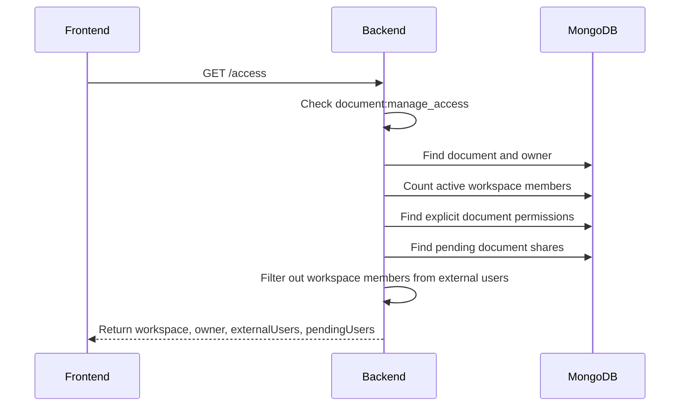

#### Backend Steps

1. Find document by:

```txt
documentId
workspaceId
```

2. Populate document owner information:

```txt
fullName
email
avatarUrl
```

3. Count active workspace members:

```txt
workspaceId = target workspace
isDeleted != true
```

4. Find explicit document permissions except owner role:

```txt
documentId = target document
role != owner
```

5. Find pending document shares:

```txt
documentId = target document
workspaceId = target workspace
status = pending
```

6. Filter explicit permissions:
   - Exclude document owner.
   - Exclude active workspace members.
   - Keep only external users.

#### Response Shape

```json
{
  "workspace": {
    "workspaceId": "...",
    "workspaceName": "...",
    "memberCount": 0
  },
  "owner": {
    "userId": "...",
    "fullName": "...",
    "email": "...",
    "avatarUrl": null,
    "role": "owner"
  },
  "externalUsers": [
    {
      "userId": "...",
      "fullName": "...",
      "email": "...",
      "avatarUrl": null,
      "role": "viewer",
      "permissionId": "...",
      "createdAt": "..."
    }
  ],
  "pendingUsers": [
    {
      "shareId": "...",
      "email": "new-user@example.com",
      "role": "commenter",
      "createdAt": "..."
    }
  ]
}
```

#### Frontend Usage

The frontend uses this response to render:

```txt
Workspace member section
Owner section
External users section
Pending users section
```

Important distinction:

```txt
externalUsers:
  Registered users who have explicit document permission
  and are not workspace members.

pendingUsers:
  Emails that were invited but have not accepted yet.
```

---

### 5. User Search Before Sharing

#### Goal

Search users by email or full name and return enough context for the frontend to decide whether the user can be shared with.

This prevents invalid sharing actions such as:

```txt
Sharing with document owner
Sharing with workspace member
Sharing with a user who already has document access
```

#### Endpoint

```txt
GET /workspaces/:workspaceId/documents/:documentId/users/search?q=:keyword
```

or:

```txt
GET /workspaces/:workspaceId/documents/:documentId/users/search?email=:email
```

Required permission:

```txt
document:manage_access
```

#### Search Input

The endpoint accepts either:

```txt
q
email
```

The backend uses:

```txt
email ?? q
```

If both are present, `email` is prioritized.

#### Empty Search

If the search keyword is empty, the backend returns:

```json
{
  "results": []
}
```

This avoids returning random users when the search bar has no meaningful input.

---

### 5.1 Registered User Search

#### Goal

Find registered users whose email or full name matches the keyword.

#### Backend Search Rule

The backend searches users by:

```txt
email contains keyword, case-insensitive
OR
fullName contains keyword, case-insensitive
```

The search is limited to:

```txt
10 users
```

#### Additional Context Loaded

For matched registered users, the backend also loads:

```txt
Workspace membership
Existing document permission
Effective document role
```

This allows the frontend to show correct disabled states and role badges.

#### Response Shape

```json
{
  "results": [
    {
      "userId": "...",
      "fullName": "Alice Nguyen",
      "email": "alice@example.com",
      "avatarUrl": null,

      "isRegistered": true,
      "isWorkspaceMember": false,
      "isOwner": false,

      "explicitDocumentRole": null,
      "effectiveDocumentRole": null,

      "canBeShared": true,
      "disabledReason": null
    }
  ]
}
```

---

### 5.2 Unregistered Email Search

#### Goal

Allow sharing with an email that does not belong to any registered user yet.

If no registered user is found and the keyword looks like an email address, the backend returns one virtual result.

#### Response Shape

```json
{
  "results": [
    {
      "email": "new-user@example.com",
      "isRegistered": false,
      "isWorkspaceMember": false,
      "isOwner": false,
      "explicitDocumentRole": null,
      "effectiveDocumentRole": null,
      "canBeShared": true,
      "disabledReason": null
    }
  ]
}
```

#### Frontend Usage

The frontend can display this as an invite-by-email option.

Example UI label:

```txt
Invite new-user@example.com
```

When submitted, the backend creates a pending document share instead of a document permission.

---

### 5.3 Search Result Permission Fields

#### isRegistered

Shows whether the result is an existing user account.

```txt
true:
  The email belongs to a registered user.

false:
  The email does not belong to a registered user yet.
```

#### isWorkspaceMember

Shows whether the user is already an active workspace member.

```txt
true:
  User already has workspace-level access.

false:
  User is not a workspace member.
```

Workspace members are not shareable through document sharing because they already receive document access from workspace role mapping.

#### isOwner

Shows whether the user is the document owner.

```txt
true:
  User is the document owner.
```

The owner cannot be shared with because owner access already exists and should not be duplicated.

#### explicitDocumentRole

Shows direct document permission if it exists.

Possible values:

```txt
editor
commenter
viewer
null
```

Owner role is not returned as an explicit document role in search results. The owner is represented by `isOwner = true`.

#### effectiveDocumentRole

Shows the final role currently resolved by the permission service.

This can come from:

```txt
Workspace membership
Explicit document permission
Document ownership
```

Possible values:

```txt
owner
editor
commenter
viewer
null
```

The frontend can use this to show the user's current actual access level.

#### canBeShared

Shows whether the selected result can be submitted to the share API.

```txt
true:
  The frontend can allow selecting this user/email.

false:
  The frontend should disable this result.
```

#### disabledReason

Explains why a search result is disabled.

Possible values:

```txt
OWNER
WORKSPACE_MEMBER
ALREADY_HAS_DOCUMENT_PERMISSION
null
```

Frontend mapping example:

```txt
OWNER:
  "Document owner already has full access."

WORKSPACE_MEMBER:
  "Workspace members already have access."

ALREADY_HAS_DOCUMENT_PERMISSION:
  "This user already has document access."
```

---

### 6. Share Document Flow

#### Goal

Grant document access to registered users or create pending shares for unregistered emails.

#### Endpoint

```txt
POST /workspaces/:workspaceId/documents/:documentId/members
```

Required permission:

```txt
document:manage_access
```

#### Request Body

```json
{
  "emails": [
    "alice@example.com",
    "new-user@example.com"
  ],
  "role": "viewer"
}
```

Supported roles:

```txt
editor
commenter
viewer
```

#### Flow

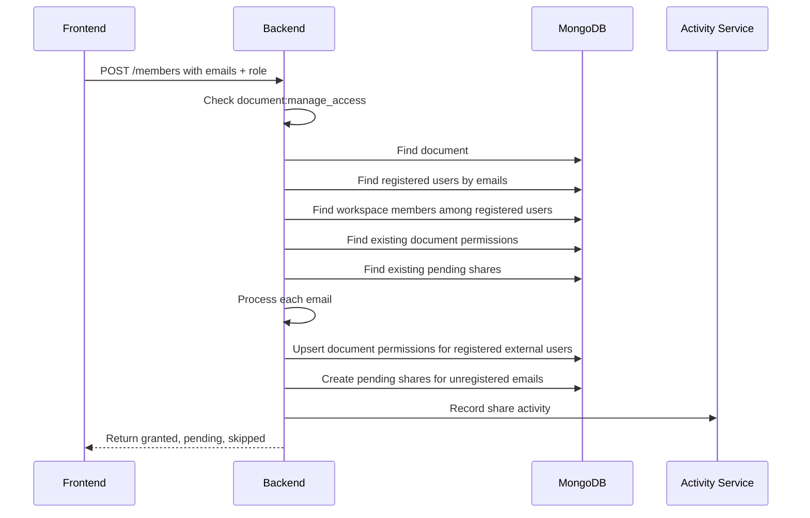

#### Backend Steps

1. Normalize emails to lowercase.
2. Remove duplicate emails.
3. Find the target document.
4. Find registered users whose emails match.
5. Find which registered users are workspace members.
6. Find existing document permissions.
7. Find existing pending shares for the same emails.
8. Process each email.
9. Return the result grouped into:

```txt
granted
pending
skipped
```

---

### 6.1 Registered External User

#### Goal

Create or update explicit document permission for a registered user who is not a workspace member.

#### Conditions

A registered user can be granted document access if:

```txt
User is not the document owner
User is not an active workspace member
User does not already have the same role
```

#### Behavior

If the user has no existing document permission:

```txt
Create document permission
```

If the user already has a different role:

```txt
Update existing document permission to the new role
```

The backend uses upsert behavior, so the same endpoint can both grant new access and update existing access.

#### Result Example

```json
{
  "granted": [
    {
      "userId": "...",
      "email": "alice@example.com",
      "role": "viewer"
    }
  ],
  "pending": [],
  "skipped": []
}
```

---

### 6.2 Unregistered Email

#### Goal

Create a pending document share for an email that does not belong to a registered user yet.

#### Behavior

The backend creates a pending share with:

```txt
documentId
workspaceId
email
role
token
status = pending
createdBy
expiresAt
```

The generated share token is converted into a frontend share link.

Default expiration:

```txt
7 days
```

#### Result Example

```json
{
  "granted": [],
  "pending": [
    {
      "shareId": "...",
      "email": "new-user@example.com",
      "role": "commenter",
      "shareLink": "http://localhost:5173/document-shares/..."
    }
  ],
  "skipped": []
}
```

#### Existing Pending Share

If a pending share already exists for the same document, workspace, and email, the backend does not create a duplicate.

Instead, it returns the existing pending share.

---

### 6.3 Skipped Share Cases

#### Goal

Explain why some emails are not granted access.

The backend can skip an email for these reasons:

```txt
OWNER
WORKSPACE_MEMBER
ALREADY_HAS_ROLE
ALREADY_HAS_DOCUMENT_PERMISSION
```

#### OWNER

The email belongs to the document owner.

The owner already has full access and cannot be shared with again.

#### WORKSPACE_MEMBER

The email belongs to an active workspace member.

Workspace members already have document access through workspace role mapping, so explicit document sharing is not needed.

#### ALREADY_HAS_ROLE

The user already has the requested role on this document.

Example:

```txt
User already has viewer role.
Request tries to grant viewer role again.
```

#### ALREADY_HAS_DOCUMENT_PERMISSION

The user already has document permission.

This reason is mainly used in search context to disable users that already have direct access.

---

### 7. Update External User Role

#### Goal

Change the role of an existing external document user.

#### Endpoint

```txt
PATCH /workspaces/:workspaceId/documents/:documentId/members/:userId
```

Required permission:

```txt
document:manage_access
```

#### Request Body

```json
{
  "role": "commenter"
}
```

Supported roles:

```txt
editor
commenter
viewer
```

#### Rules

The backend rejects the update if:

```txt
Target user is the document owner
Target user is an active workspace member
Target permission does not exist
Target permission role is owner
Target user already has the requested role
```

#### Flow

```txt
Find document
-> Check target is not owner
-> Check target is not workspace member
-> Find document permission
-> Update role
-> Return updated permission
```

#### Why Workspace Members Cannot Be Updated Here

Workspace members get document access from workspace role mapping.

To change a workspace member's access, update their workspace role or membership, not their explicit document permission.

---

### 8. Remove External User Access

#### Goal

Remove explicit document access from an external user.

#### Endpoint

```txt
DELETE /workspaces/:workspaceId/documents/:documentId/members/:userId
```

Required permission:

```txt
document:manage_access
```

#### Rules

The backend rejects removal if:

```txt
Target user is the document owner
Target user is an active workspace member
Target permission does not exist
Target permission role is owner
```

#### Flow

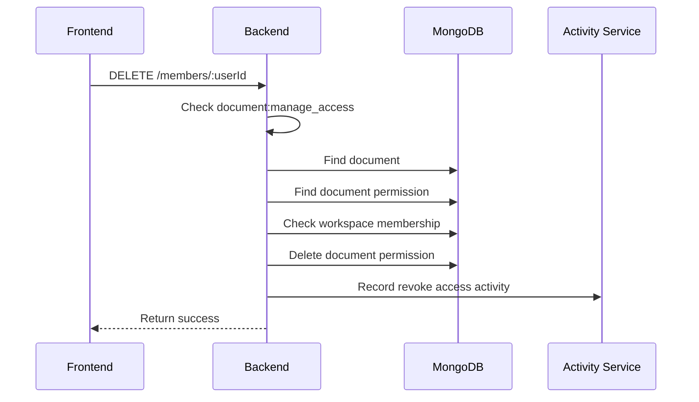

#### Result

```json
{
  "success": true
}
```

After removal, the user can no longer access the document unless they also have workspace-based access.

---

### 9. Update Pending Share Role

#### Goal

Change the role of an invitation that has not been accepted yet.

#### Endpoint

```txt
PATCH /workspaces/:workspaceId/documents/:documentId/pending-shares/:shareId
```

Required permission:

```txt
document:manage_access
```

#### Request Body

```json
{
  "role": "editor"
}
```

#### Rules

The pending share must match:

```txt
shareId
documentId
workspaceId
status = pending
```

If no matching pending share exists, the backend returns not found.

#### Result Example

```json
{
  "shareId": "...",
  "email": "new-user@example.com",
  "role": "editor",
  "createdAt": "..."
}
```

---

### 10. Cancel Pending Share

#### Goal

Cancel a pending document share before it is accepted.

#### Endpoint

```txt
DELETE /workspaces/:workspaceId/documents/:documentId/pending-shares/:shareId
```

Required permission:

```txt
document:manage_access
```

#### Behavior

The backend does not hard-delete the pending share.

It changes the status to:

```txt
revoked
```

#### Result

```json
{
  "success": true
}
```

A revoked share token can no longer be accepted.

---

### 11. Resolve Document Share Token

#### Goal

Allow the frontend to display invitation information before the user accepts the share.

#### Endpoint

```txt
GET /document-shares/:token/resolve
```

#### Flow

```txt
Frontend opens /document-shares/:token
-> Frontend calls resolve endpoint
-> Backend checks token
-> Backend returns document title, workspace name, email, role, status
```

#### Backend Steps

1. Find pending share by token.
2. Populate document title.
3. Populate workspace name.
4. Check expiration.
5. If the share is pending but expired, update status to:

```txt
expired
```

6. Return share information.

#### Response Shape

```json
{
  "documentTitle": "Project Proposal.pdf",
  "workspaceName": "Marketing Workspace",
  "email": "new-user@example.com",
  "role": "viewer",
  "status": "pending"
}
```

Possible status values:

```txt
pending
accepted
revoked
expired
```

---

### 12. Accept Document Share Token

#### Goal

Allow the invited user to accept document access.

#### Endpoint

```txt
POST /document-shares/:token/accept
```

Expected user state:

```txt
Authenticated user
```

#### Flow

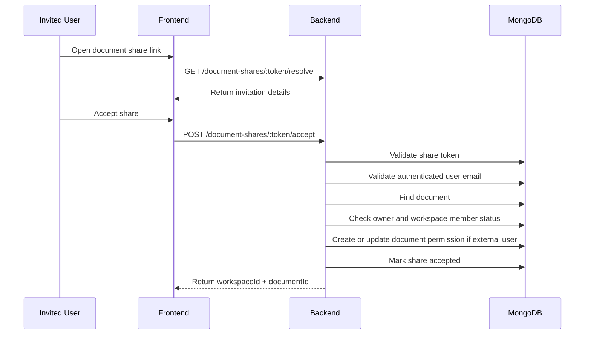

#### Validation Rules

The backend checks:

```txt
Share token exists
Share status is pending
Share is not expired
Authenticated user exists
Authenticated user's email matches share email
Document exists
Authenticated user is not the document owner
```

If the authenticated user's email does not match the invited email, the backend rejects the request.

#### Case A: User Is Not a Workspace Member

The backend creates or updates explicit document permission:

```txt
documentId = shared document
userId = authenticated user
role = pending share role
grantedBy = share creator
```

Then it marks the share as:

```txt
status = accepted
acceptedBy = userId
acceptedAt = current time
```

#### Case B: User Is Already a Workspace Member

If the invited user is already a workspace member, they already have access through workspace role mapping.

In this case, the backend only marks the pending share as accepted and returns the target document location.

It does not create an extra document permission record.

#### Response Shape

```json
{
  "workspaceId": "...",
  "documentId": "..."
}
```

The frontend can redirect to:

```txt
/workspaces/:workspaceId/documents/:documentId
```

---

### 13. Activity Log Integration

#### Goal

Document sharing actions are recorded in workspace activity logs.

#### Share Activity

Recorded when:

```txt
A registered external user is granted access
A registered external user's role is updated through share endpoint
An unregistered email receives a pending share
```

Activity metadata can include:

```txt
documentId
documentTitle
sourceType
targetUserId
targetUserEmail
targetUserFullName
targetUserAvatarUrl
role
oldRole
newRole
shareStatus
changeType
```

#### Revoke Activity

Recorded when:

```txt
External user access is removed
Pending share is revoked
```

Activity metadata can include:

```txt
documentId
documentTitle
sourceType
targetUserId
targetUserEmail
targetUserFullName
targetUserAvatarUrl
revokedRole
role
pending
shareId
email
```

Activity logs help workspace admins understand who shared or revoked document access.

---

### 14. Frontend Sharing Modal Behavior

#### Goal

Use backend responses to render a clear sharing experience.

#### Initial Load

When the modal opens, the frontend should call:

```txt
GET /workspaces/:workspaceId/documents/:documentId/access
```

Then render:

```txt
Workspace section:
  Workspace name and member count

Owner section:
  Document owner

External users section:
  Users with explicit document permission

Pending users section:
  Emails with pending document share
```

#### Searching Users

When the user types into the search bar, the frontend should call:

```txt
GET /users/search?q=:keyword
```

or:

```txt
GET /users/search?email=:email
```

The frontend should use these fields:

```txt
canBeShared
disabledReason
isRegistered
isWorkspaceMember
isOwner
explicitDocumentRole
effectiveDocumentRole
```

#### Search UI Rules

```txt
canBeShared = true:
  Allow selecting the result.

canBeShared = false:
  Disable the result and show reason.

isRegistered = false:
  Show as invite-by-email option.

isWorkspaceMember = true:
  Disable because workspace member already has access.

isOwner = true:
  Disable because owner already has full access.

explicitDocumentRole != null:
  Disable or show current direct access role.

effectiveDocumentRole != null:
  Show current effective access role.
```

#### Sharing Selected Users

After selecting one or more emails and a role, the frontend calls:

```txt
POST /members
```

Then it should use the response groups:

```txt
granted:
  Add users to external users section.

pending:
  Add emails to pending users section.

skipped:
  Show non-blocking message explaining why some emails were skipped.
```

---

### 15. Data Model

#### Document Permission

Used for registered users with direct document access.

Main fields:

```txt
documentId
userId
role
grantedBy
createdAt
updatedAt
```

Supported external roles:

```txt
editor
commenter
viewer
```

The document owner is not managed like a normal external user in the sharing modal.

#### Pending Document Share

Used for unregistered emails or emails that have not accepted yet.

Main fields:

```txt
documentId
workspaceId
email
role
token
status
createdBy
expiresAt
acceptedBy
acceptedAt
createdAt
updatedAt
```

Possible statuses:

```txt
pending
accepted
revoked
expired
```

---

### 16. Error Handling

#### Common Errors

```txt
Document not found:
  The target document does not exist in the workspace.

Permission denied:
  The actor does not have document:manage_access.

Cannot change role of document owner:
  The target user is the document owner.

Cannot remove document owner:
  The target user is the document owner.

Workspace member already has access:
  The target user is already a workspace member.

Permission not found:
  The target external user does not have direct document permission.

Pending share not found:
  The pending share does not exist or is no longer pending.

Share invitation not found:
  The token does not exist.

Share invitation expired:
  The token is expired.

This invitation belongs to another email:
  Authenticated user's email does not match the invited email.
```

---

### 17. Design Decisions

#### Document Sharing Does Not Replace Workspace Membership

Document sharing gives access to one document only.

It should not grant access to the workspace document list or workspace settings.

#### Workspace Members Are Not Shared Again

Workspace members already have document access through workspace role mapping.

Creating explicit document permissions for them would duplicate access and make permission resolution harder.

#### Pending Share Supports Unregistered Users

The app allows sharing to an email even before the user has registered.

This keeps the sharing flow natural:

```txt
Type email
Choose role
Send share
User accepts later
```

#### Explicit IDs and Context Are Returned to FE

The search API returns contextual fields like `canBeShared`, `disabledReason`, and `effectiveDocumentRole`.

This allows the frontend to explain why a result is disabled instead of failing only after submission.

#### Token Acceptance Is Email-bound

A share token can only be accepted by a user whose email matches the invited email.

This prevents a user from accepting another person's document share.

---

### 18. Summary

#### Access Panel

```txt
GET /access
-> returns workspace, owner, externalUsers, pendingUsers
```

#### Search

```txt
GET /users/search?q=:keyword
-> searches registered users by email/fullName
-> returns unregistered email option if keyword is an email and no user exists
-> returns permission context:
     isRegistered
     isWorkspaceMember
     isOwner
     explicitDocumentRole
     effectiveDocumentRole
     canBeShared
     disabledReason
```

#### Share

```txt
POST /members
-> registered external user:
     create or update DocumentPermission

-> unregistered email:
     create PendingDocumentShare

-> owner/workspace member/same role:
     skip
```

#### Manage Existing Access

```txt
PATCH /members/:userId
-> update external user's document role

DELETE /members/:userId
-> remove external user's document permission

PATCH /pending-shares/:shareId
-> update pending share role

DELETE /pending-shares/:shareId
-> revoke pending share
```

#### Accept Invitation

```txt
GET /document-shares/:token/resolve
-> show invitation details

POST /document-shares/:token/accept
-> validate email
-> create document permission if user is external
-> mark share accepted
-> return workspaceId and documentId
```

#### Final Rule

```txt
Workspace members get access from workspace roles.
External users get access from explicit document permissions.
Unregistered emails wait in pending document shares.
Only document managers can share or revoke document access.
```
## Document Search Module

### 1. Overview

#### Goal

The Document Search module allows an authenticated user to search documents they are allowed to access.

Search is global across the user's accessible documents, not limited to one workspace by default.

A document can be searchable for the user through two access paths:

```txt
Workspace access:
  The user is an active member of the document's workspace.

Direct document access:
  The user has explicit document permission on that document.
```

The module supports:

```txt
Full-text search by title and extracted text preview
Workspace filtering
Updated date filtering
Pagination
Sorting by relevance or updated time
Search preview text
Workspace filter options
Access type information in each result
```

---

### 2. Main Endpoints

#### Search Documents

```txt
GET /documents/search
```

This endpoint returns paginated documents that the current authenticated user can access.

#### Workspace Filter Options

```txt
GET /documents/search/workspaces
```

This endpoint returns the list of workspaces that the current user can use as search filters.

---

### 3. Searchable Document Fields

#### Goal

The search module uses MongoDB text search.

The searchable fields are:

```txt
title
extractedTextPreview
```

The document schema defines a text index on these fields:

```txt
title: text
extractedTextPreview: text
```

#### title

The document title is always part of search.

Example:

```txt
q = "contract"
```

Can match:

```txt
Contract.pdf
Final Contract Review
```

#### extractedTextPreview

The extracted text preview is generated during document processing.

For uploaded PDFs, this text comes from PDF extraction.

For markdown documents, this text comes from the markdown content converted into plain text.

The app only stores a limited preview of extracted text.

Current limit:

```txt
10,000 characters
```

This means the search module searches only the stored preview, not necessarily the entire original PDF.

---

### 4. Search Scope

#### Goal

Search results must only include documents the user is allowed to access.

The backend builds an accessible scope for the current user before searching.

The scope contains:

```txt
memberWorkspaceIds
memberWorkspaceIdSet
directDocumentIds
directRoleMap
```

#### memberWorkspaceIds

A list of workspace IDs where the user is an active workspace member.

A valid workspace membership must match:

```txt
userId = current user
isDeleted = false
```

All processed documents inside these workspaces can appear in search results.

#### directDocumentIds

A list of document IDs where the user has explicit document permission.

Supported direct roles:

```txt
viewer
commenter
editor
```

These documents can appear in search results even if the user is not a workspace member.

#### directRoleMap

A map from document ID to direct document role.

It is used to return the user's direct role when the result is accessed through explicit document sharing.

Example:

```txt
documentId -> viewer
documentId -> commenter
documentId -> editor
```

---

### 5. Default Search Behavior

#### Goal

When no workspace filter is provided, the search module searches all accessible documents.

Default accessible documents are:

```txt
Documents in workspaces where the user is an active member
+
Documents directly shared with the user
```

Backend filter idea:

```txt
processingStatus = processed

AND

(
  workspaceId in memberWorkspaceIds
  OR
  documentId in directDocumentIds
)
```

This ensures users cannot search documents they do not have access to.

---

### 6. Workspace Filter Behavior

#### Goal

Allow the user to narrow search results to specific workspaces.

Query parameter:

```txt
workspaceIds
```

Supported formats:

```txt
/documents/search?workspaceIds=workspaceId1
/documents/search?workspaceIds=workspaceId1&workspaceIds=workspaceId2
/documents/search?workspaceIds=workspaceId1,workspaceId2
```

#### Validation

Every selected workspace ID must belong to the current user.

If the user selects a workspace they do not belong to, the backend rejects the request.

Example error:

```txt
You do not belong to one or more selected workspaces
```

#### Important Behavior

When `workspaceIds` is provided, the search is restricted to those workspace IDs.

In that case, the backend searches:

```txt
workspaceId in selected workspaceIds
```

This means direct shared documents outside the selected workspace filter are not included.

This is expected because workspace filtering means:

```txt
Search inside these selected workspaces only.
```

---

### 7. Workspace Filter Options

#### Goal

Return workspaces that the user can select in the search filter UI.

Endpoint:

```txt
GET /documents/search/workspaces
```

#### Backend Behavior

The backend finds active workspace memberships for the current user:

```txt
userId = current user
isDeleted = false
```

It populates:

```txt
workspaceId
workspace name
role
```

Deleted workspaces are filtered out.

#### Response Shape

```json
[
  {
    "workspaceId": "...",
    "name": "Engineering",
    "role": "admin"
  },
  {
    "workspaceId": "...",
    "name": "Marketing",
    "role": "member"
  }
]
```

#### Frontend Usage

The frontend can use this endpoint to render workspace filter checkboxes or dropdown options.

Only workspace memberships appear here.

Documents shared directly with the user do not create workspace filter options.

---

### 8. Query Parameters

#### q

Search text.

Example:

```txt
/documents/search?q=invoice
```

If `q` is empty or missing, the backend returns accessible processed documents without text filtering.

#### workspaceIds

Workspace filter.

Can be repeated or comma-separated.

Example:

```txt
/documents/search?workspaceIds=abc,def
```

#### updatedFrom

Lower bound for document updated date.

Example:

```txt
/documents/search?updatedFrom=2026-06-01
```

The backend applies:

```txt
updatedAt >= updatedFrom
```

#### updatedTo

Upper bound for document updated date.

Example:

```txt
/documents/search?updatedTo=2026-06-30
```

If the value is date-only format, the backend treats it as the end of that day.

Example:

```txt
2026-06-30
-> 2026-06-30 23:59:59.999
```

The backend applies:

```txt
updatedAt <= updatedTo
```

#### page

Pagination page.

Default:

```txt
1
```

Minimum:

```txt
1
```

#### limit

Number of items per page.

Default:

```txt
20
```

Maximum:

```txt
50
```

#### sort

Sorting mode.

Supported values:

```txt
relevance
updated_desc
updated_asc
```

---

### 9. Date Filter Rules

#### Goal

Allow searching documents updated within a specific time range.

Supported filters:

```txt
updatedFrom
updatedTo
```

#### Valid Range

If both values are provided:

```txt
updatedFrom must be before updatedTo
```

If `updatedFrom` is later than `updatedTo`, the backend returns a bad request error.

#### Invalid Date

If either date cannot be parsed, the backend returns a bad request error.

Examples:

```txt
Invalid updatedFrom
Invalid updatedTo
```

---

### 10. Sorting Rules

#### Goal

Allow search results to be ordered by relevance or update time.

#### Default Sort

If `q` is provided:

```txt
sort = relevance
```

If `q` is not provided:

```txt
sort = updated_desc
```

#### relevance

Used only when search text exists.

Sorting rule:

```txt
MongoDB textScore descending
updatedAt descending
_id descending
```

This means the best text match appears first. If multiple documents have similar relevance, the most recently updated document appears first.

#### updated_desc

Sort by newest updated document first.

Sorting rule:

```txt
updatedAt descending
_id descending
```

#### updated_asc

Sort by oldest updated document first.

Sorting rule:

```txt
updatedAt ascending
_id ascending
```

#### Fallback

If `sort = relevance` but no search text is provided, the backend falls back to updated descending order.

---

### 11. Pagination

#### Goal

Return search results in pages instead of loading everything at once.

The backend uses page-based pagination.

Query parameters:

```txt
page
limit
```

Pagination calculation:

```txt
skip = (page - 1) * limit
```

Response metadata:

```txt
page
limit
totalItems
totalPages
hasNextPage
hasPreviousPage
```

#### Response Shape

```json
{
  "items": [],
  "page": 1,
  "limit": 20,
  "totalItems": 0,
  "totalPages": 0,
  "hasNextPage": false,
  "hasPreviousPage": false
}
```

---

### 12. Search Result Shape

#### Goal

Return enough document information for the frontend search result UI.

Each item contains:

```txt
documentId
title
workspace
sourceType
previewText
updatedAt
accessType
role
```

#### Example

```json
{
  "documentId": "...",
  "title": "Project Proposal.pdf",
  "workspace": {
    "workspaceId": "...",
    "name": "Marketing"
  },
  "sourceType": "file_upload",
  "previewText": "...project proposal content...",
  "updatedAt": "2026-06-23T00:00:00.000Z",
  "accessType": "workspace"
}
```

For direct shared documents:

```json
{
  "documentId": "...",
  "title": "External Contract.pdf",
  "workspace": {
    "workspaceId": "...",
    "name": "Legal"
  },
  "sourceType": "file_upload",
  "previewText": "...contract preview...",
  "updatedAt": "2026-06-23T00:00:00.000Z",
  "accessType": "direct",
  "role": "viewer"
}
```

---

### 13. Access Type

#### Goal

Tell the frontend why the user can access this document.

Supported values:

```txt
workspace
direct
```

#### workspace

The user can access the document because they are a member of the document's workspace.

Example:

```txt
accessType = workspace
```

This result does not need a direct role field because access comes from workspace membership.

#### direct

The user can access the document because it was shared directly with them.

Example:

```txt
accessType = direct
role = viewer
```

The role field is included only for direct access results.

Possible direct roles:

```txt
viewer
commenter
editor
```

---

### 14. Preview Text

#### Goal

Show a short text snippet in the search result.

The backend builds `previewText` from:

```txt
extractedTextPreview
```

#### Without Search Text

If no search text is provided, the preview is:

```txt
first 220 characters of extractedTextPreview
```

#### With Search Text

If search text is provided, the backend:

```txt
1. Normalizes whitespace.
2. Splits the query into search terms.
3. Finds the first matching term inside extractedTextPreview.
4. Returns a short snippet around that match.
```

Snippet window:

```txt
80 characters before the match
80 characters after the match
```

If no term is found inside the preview text, the backend returns the first 220 characters.

#### Search Term Parsing

The backend removes punctuation and splits the query into unique terms.

This supports normal user search text such as:

```txt
"contract, invoice review"
```

Search terms become:

```txt
contract
invoice
review
```

---

### 15. Processing Status Rule

#### Goal

Only ready documents should appear in search results.

The search filter always includes:

```txt
processingStatus = processed
```

This means the search module excludes:

```txt
processing documents
unprocessable documents
```

#### Why

A processing document may not have a final PDF or extracted text preview yet.

An unprocessable document may not have reliable searchable content.

The user can still see these documents in the normal workspace document list, but they are not included in global search results.

---

### 16. Security Rules

#### Authenticated User Required

The search module depends on the current user ID from the request.

The user must be authenticated.

#### Access Scope Is Built Server-side

The frontend cannot decide what documents are searchable.

The backend builds access scope from database records:

```txt
WorkspaceMember
DocumentPermission
```

#### Workspace Filter Is Validated

A user cannot inject arbitrary workspace IDs into `workspaceIds`.

If any selected workspace does not belong to the user, the backend rejects the request.

#### Direct Access Is Limited to Explicit Roles

Direct access search only includes document permissions with these roles:

```txt
viewer
commenter
editor
```

Owner is handled through normal workspace/document ownership logic, not as an external direct search role.

---

### 17. Frontend Flow

#### Goal

The frontend uses the search endpoint to build a global document search experience.

#### Initial Load

When opening the search page or search modal:

```txt
GET /documents/search?page=1&limit=20
GET /documents/search/workspaces
```

The first request loads recent accessible processed documents.

The second request loads workspace filter options.

#### Search Input

When the user types a keyword:

```txt
GET /documents/search?q=:keyword&page=1&limit=20
```

The frontend should reset `page` to `1` when the search keyword changes.

#### Workspace Filter

When the user selects workspace filters:

```txt
GET /documents/search?q=:keyword&workspaceIds=:id1,:id2&page=1
```

The frontend should reset `page` to `1` when workspace filter changes.

#### Date Filter

When the user applies date range filters:

```txt
GET /documents/search?updatedFrom=2026-06-01&updatedTo=2026-06-30
```

The frontend should send ISO date strings or date-only strings.

#### Sorting

When the user changes sorting:

```txt
GET /documents/search?q=contract&sort=relevance
GET /documents/search?sort=updated_desc
GET /documents/search?sort=updated_asc
```

Recommended frontend defaults:

```txt
With keyword:
  relevance

Without keyword:
  updated_desc
```

---

### 18. Example Requests

#### Search All Accessible Documents

```txt
GET /documents/search?q=contract&page=1&limit=20
```

#### Search in Selected Workspaces

```txt
GET /documents/search?q=contract&workspaceIds=workspaceId1,workspaceId2
```

#### Search Updated This Month

```txt
GET /documents/search?updatedFrom=2026-06-01&updatedTo=2026-06-30
```

#### Search Direct and Workspace Documents Without Keyword

```txt
GET /documents/search?page=1&limit=20
```

#### Get Workspace Filter Options

```txt
GET /documents/search/workspaces
```

---

### 19. Error Handling

#### Unauthorized Workspace Filter

If user selects a workspace they do not belong to:

```txt
403 Forbidden
You do not belong to one or more selected workspaces
```

#### Invalid Date

If `updatedFrom` or `updatedTo` cannot be parsed:

```txt
400 Bad Request
Invalid updatedFrom
```

or:

```txt
400 Bad Request
Invalid updatedTo
```

#### Invalid Date Range

If `updatedFrom` is after `updatedTo`:

```txt
400 Bad Request
updatedFrom must be before updatedTo
```

#### Invalid Limit

If limit is greater than the maximum allowed value:

```txt
400 Bad Request
```

Current maximum:

```txt
50
```

#### Invalid Sort

If sort is not one of the supported values:

```txt
400 Bad Request
```

Supported values:

```txt
relevance
updated_desc
updated_asc
```

---

### 20. Design Decisions

#### Global Search Uses Access Scope

The search module does not expose all documents.

It first calculates the user's accessible scope, then searches only inside that scope.

This prevents leaking document titles or extracted text from private workspaces.

#### Search Only Processed Documents

Search excludes documents that are still processing or unprocessable.

This keeps search results reliable and avoids returning documents without stable extracted text.

#### Text Search Uses Preview, Not Full PDF Content

The app stores only `extractedTextPreview`, so search is limited to that preview.

This reduces storage cost and keeps MongoDB documents smaller, but it means search may not find text outside the stored preview.

#### Workspace Filter Only Uses Membership Workspaces

Workspace filter options are based on active workspace memberships.

Direct shared documents can appear in global search, but they do not create workspace filter options.

#### Search Result Includes Access Type

Each search result includes `accessType` so the frontend can explain why the user can access the document.

```txt
workspace:
  Access comes from workspace membership.

direct:
  Access comes from explicit document sharing.
```

---

### 21. Summary

#### Main Endpoints

```txt
GET /documents/search
GET /documents/search/workspaces
```

#### Search Fields

```txt
title
extractedTextPreview
```

#### Access Sources

```txt
Workspace membership
Direct document permission
```

#### Filters

```txt
q
workspaceIds
updatedFrom
updatedTo
page
limit
sort
```

#### Sorting

```txt
relevance
updated_desc
updated_asc
```

#### Result Item

```txt
documentId
title
workspace
sourceType
previewText
updatedAt
accessType
role
```

#### Final Rule

```txt
Search only returns processed documents that the current user can access.
Workspace members find documents through workspace access.
External users find shared documents through direct document permission.
Search text matches document title and extracted text preview.
```

## Activity Log Module

### 1. Overview

#### Goal

The Activity Log module records important actions that happen inside a workspace.

It is used to provide a workspace history so members can understand what changed, who performed the action, and when it happened.

The module focuses on audit-style events such as:

```txt
Workspace changes
Member changes
Document changes
Document sharing changes
```

Activity logs are not used as the source of truth for business data. They are a historical record derived from actions performed by other modules.

---

### 2. Main Use Cases

#### Workspace Activity

The module can record actions related to workspace management.

Examples:

```txt
Workspace created
Workspace updated
Workspace deleted
Member invited
Member joined
Member removed
Member role changed
```

#### Document Activity

The module records important document lifecycle events.

Examples:

```txt
Document created
Document renamed
Document deleted
Document content updated
```

#### Sharing Activity

The module records document access changes.

Examples:

```txt
Document shared with user
Pending share created for email
External user's role updated
External user's access revoked
Pending share revoked
```

---

### 3. Data Model

#### Goal

Each activity log entry stores enough information to display a readable event in the workspace activity page.

Common fields:

```txt
workspaceId
actorId
action
targetType
targetId
metadata
createdAt
```

#### Field Explanation

```txt
workspaceId:
  The workspace where the action happened.

actorId:
  The user who performed the action.

action:
  The type of activity, such as document_created or member_invited.

targetType:
  The kind of entity affected by the action.
  Examples: workspace, document, member, document_share.

targetId:
  The ID of the affected entity.

metadata:
  Extra data used by the frontend to render meaningful messages.

createdAt:
  Time when the activity was recorded.
```

---

### 4. Metadata

#### Goal

Metadata makes the activity log flexible.

Different activity types need different extra fields.

Example for document rename:

```json
{
  "oldTitle": "Draft.pdf",
  "newTitle": "Final.pdf",
  "documentTitle": "Final.pdf"
}
```

Example for document sharing:

```json
{
  "documentTitle": "Proposal.pdf",
  "targetUserEmail": "alice@example.com",
  "role": "viewer"
}
```

Example for member role change:

```json
{
  "targetUserEmail": "bob@example.com",
  "oldRole": "member",
  "newRole": "admin"
}
```

This avoids creating many different database schemas for each activity type.

---

### 5. Recording Flow

#### Goal

Other modules call the Activity Log service after a successful business action.

Example flow:

```txt
User renames document
-> DocumentService validates permission
-> DocumentService updates document title
-> ActivityLogService records document_renamed event
-> API returns updated document
```

The activity log should be written only after the main action succeeds.

If the business action fails, no activity should be recorded.

---

### 6. Reading Activity Logs

#### Goal

Allow workspace users to view recent workspace activity.

Typical endpoint:

```txt
GET /workspaces/:workspaceId/activity-logs
```

Required permission:

```txt
workspace:view_activity_log
```

or another workspace-level permission depending on the app rule.

The backend should:

```txt
1. Check workspace permission.
2. Query activity logs by workspaceId.
3. Sort by createdAt descending.
4. Apply pagination.
5. Populate actor information.
6. Return logs to frontend.
```

---

### 7. Frontend Usage

#### Goal

The frontend uses activity logs to render a human-readable timeline.

Example messages:

```txt
Nguyen created document "Proposal.pdf".
Nguyen renamed "Draft.pdf" to "Final.pdf".
Nguyen shared "Contract.pdf" with alice@example.com as viewer.
Nguyen revoked access from bob@example.com.
```

The frontend should use:

```txt
action
actor
metadata
createdAt
```

to build the display message.

---

### 8. Why Use an Activity Log

#### Auditability

Workspace members can see important changes over time.

#### Debugging

Activity logs help explain why a document, member, or permission changed.

#### Transparency

Users can understand who performed an action instead of seeing unexplained state changes.

#### Loose Coupling

The activity log is written by other modules, but it does not control their business logic.

The source of truth remains in the main collections such as:

```txt
Workspace
WorkspaceMember
Document
DocumentPermission
PendingShare
```

---

### 9. Design Notes

#### Activity Log Is Append-only

Activity logs should normally be inserted, not updated.

This preserves historical accuracy.

#### Metadata Should Be Small

Metadata should contain only useful display information.

It should not duplicate full document, user, or workspace records.

#### Activity Log Is Not Permission Source

The app should never use activity logs to decide current access.

Permissions must still be resolved from workspace membership and document permission records.

---

### 10. Summary

#### Purpose

```txt
Record important workspace, document, member, and sharing actions.
```

#### Written By

```txt
Workspace module
Document module
Document sharing module
Invitation/member module
```

#### Read By

```txt
Workspace activity page
Admin/member audit UI
```

#### Final Rule

```txt
Activity logs describe what happened.
They do not decide what is currently allowed.
Business collections remain the source of truth.
```
